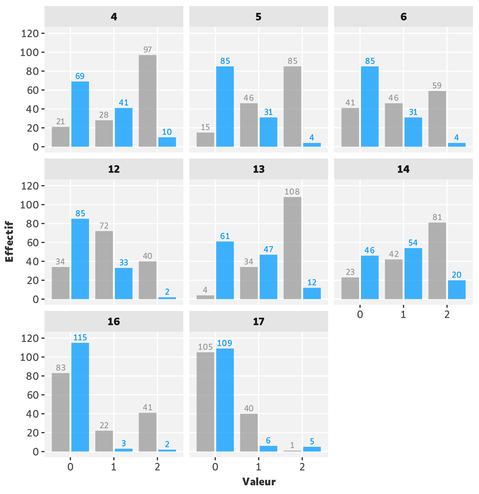
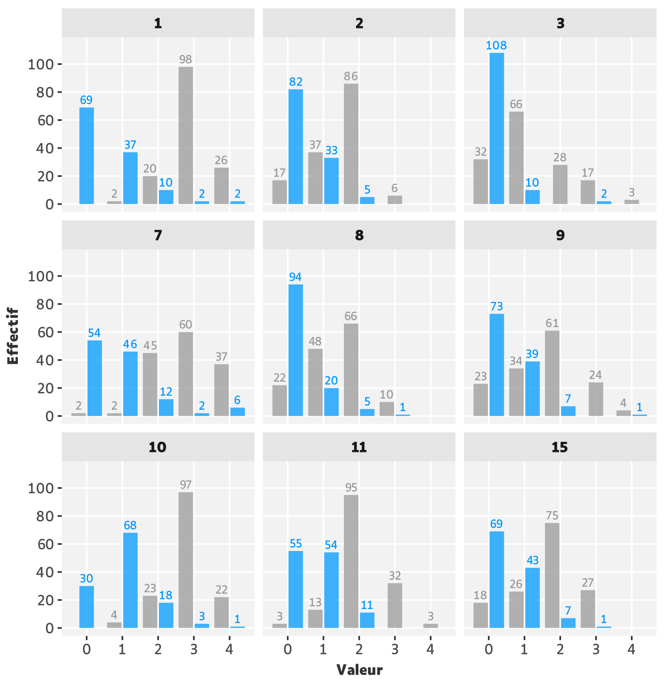
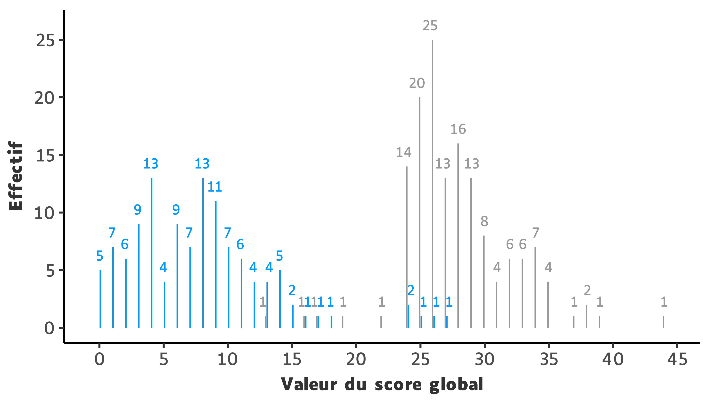
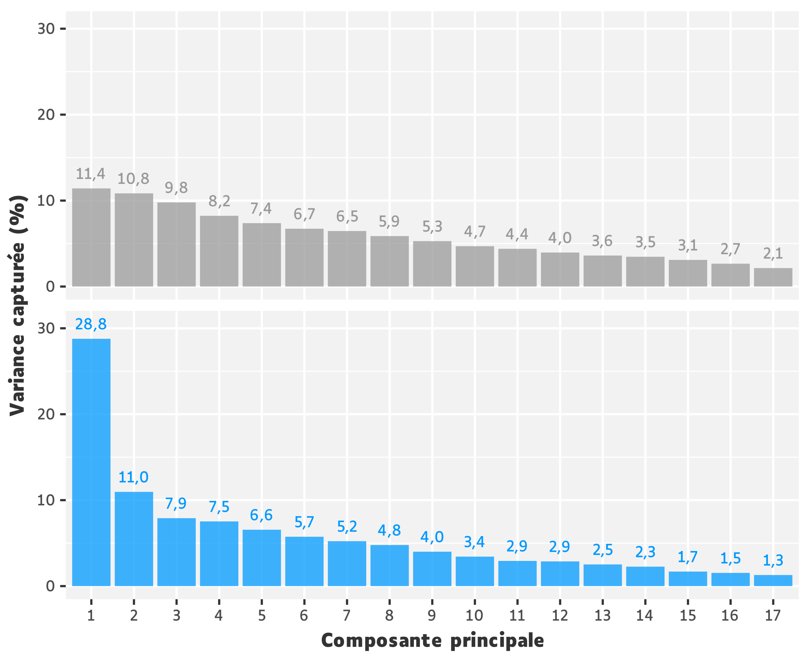
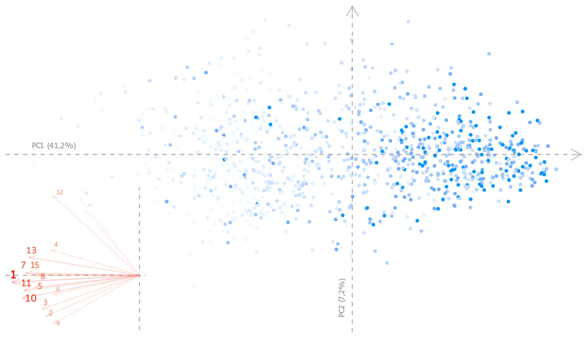
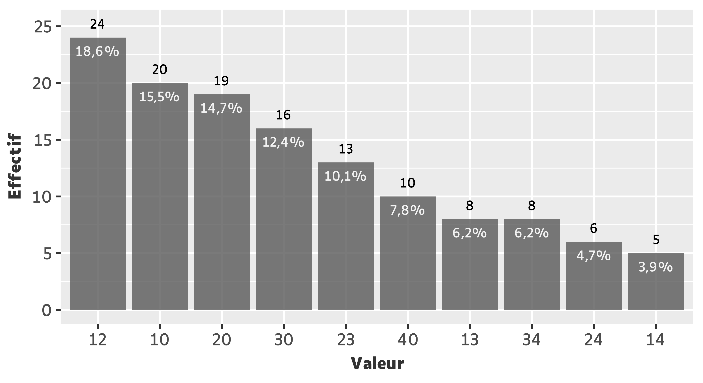
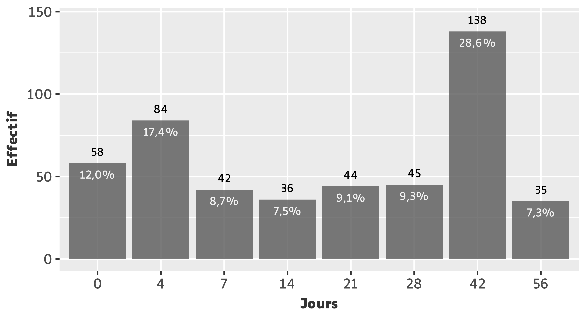
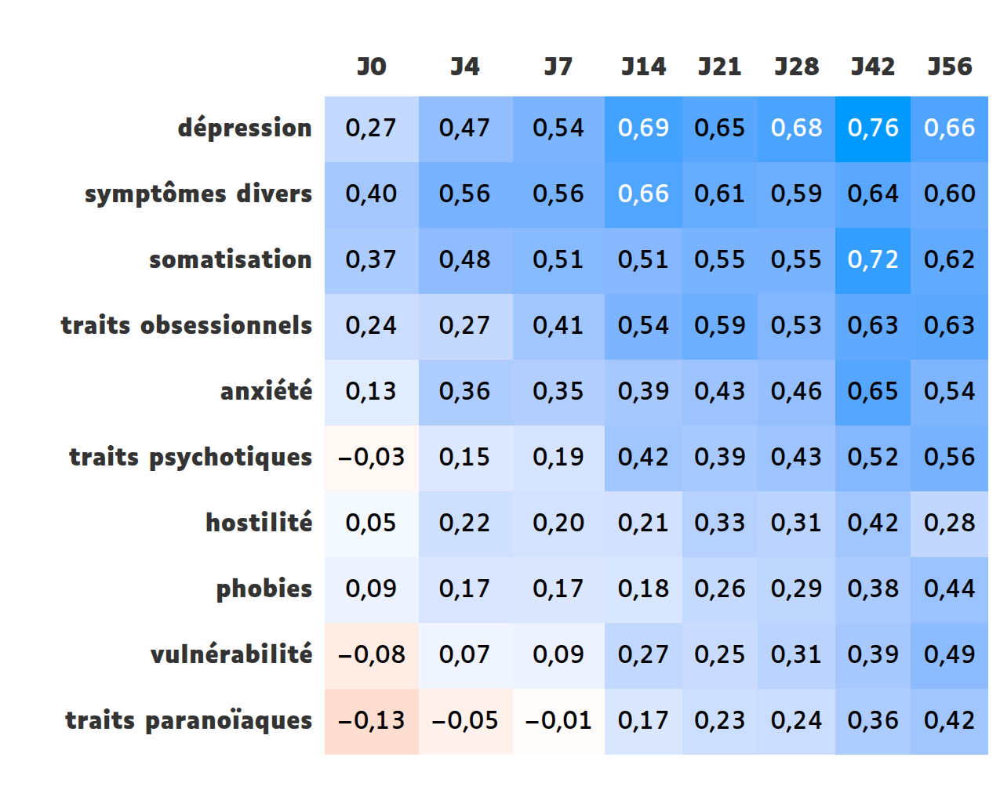
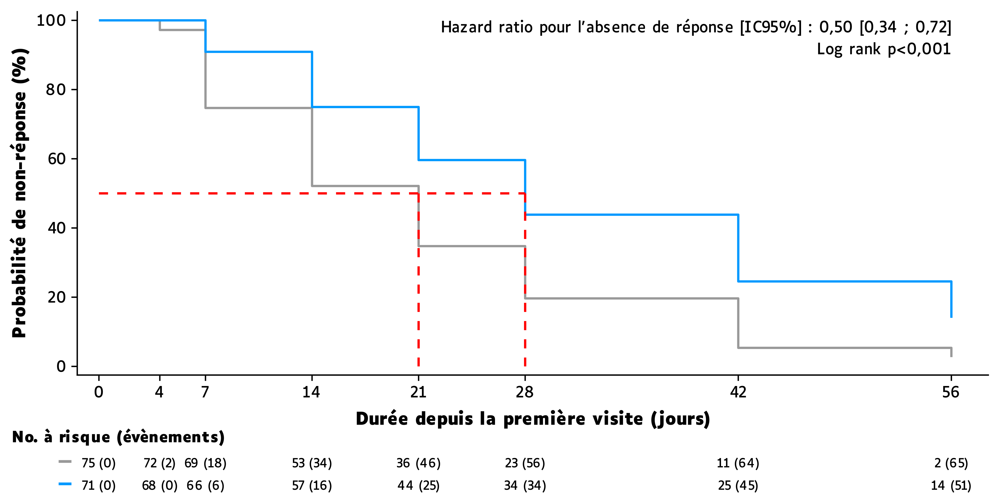

```{r}
#| label: setup
#| include: false

library(knitr)

quiet <- TRUE

source("scripts/_setup.R")

auto_exec()

.pal <- opts$palette

.subtitle_hdrs <-
glue("Parmi les {nrow(hdrs$item$j0)} sujets évalués à J0,
     {nrow(hdrs$item$j56)} ({hdrs$pct$j56}) étaient évalués à J56.")
```

# Énoncé {.unnumbered .unlisted}

Dans une étude d'épidémiologie clinique, 146 patients déprimés sont évalués à `r .ind$j_str` à l'aide d'une auto-évaluation (échelle SCL90) et d'une hétéro-évaluation (échelle de dépression de Hamilton).

Nous disposons de 3 jeux de données :

  - `groupe.xls` : 2 sous-groupes de patients
  - `scl.xls` : échelle d'auto-évaluation SCL90
  - `hdrs.xls` : échelle de dépression de Hamilton (HDRS)

###### **Objectifs**

1. Vérifier la validité de l'échelle HDRS à J0 et J56.
2. À partir du score brut de Hamilton, déterminez si les patients du groupe 1 répondent mieux au traitement que les patients du groupe 0 (utiliser d'abord une approche LOCF puis un modèle mixte).
3. Même question en considérant le critère binaire censuré *"réponse au traitement"* défini par une chute de 50% sur l'échelle HDRS par rapport à J0.

::: callout-note
# Note

L'ensemble du code est divisé en 2 types de scripts :

- Préparation des données (`_setup.R`)
- Production des tableaux et figures (`tbl_*.R` ou `fig_*.R`)

Les paramètres et objets définis dans `_setup.R` sont injectés dans les scripts tableaux et figures, exécutés en aval, afin d'éviter toute duplication de code.

Les tableaux et figures numérotés sont précédés de leur script respectif (replié par défaut). Si plusieurs éléments sont produits par un même script, celui-ci est placé soit uniquement devant le premier élément, soit placé à plusieurs reprises avec une numérotation.

L'ensemble du matériel est accessible depuis un dépôt git en cliquant sur [</> Code]{.nb} en haut à droite de la page.

Aucun large language model n'est utilisé pour la rédaction du code ou du texte.
:::

::: callout-important
# Le contenu de ce devoir n'est pas corrigé
:::

::: {add-from=scripts/_setup.R code-line-numbers="true" code-filename="_setup.R"}
```r
```
:::

# Composition de l'échelle HDRS

## Description du jeu de données

```{r}
.hdrs <- list_c(hdrs$item)
```

Le jeu de données `hdrs.xls` était constitué de **`r nrow(.hdrs)` observations** pour **`r length(.hdrs)` variables**.
Les observations portaient sur **`r n_distinct(.hdrs$numero)` sujets** évalués sur **`r ncol(.hdrs |> select(matches("hamd")))` items**.

Les items `hamd16a` et `hamd16b`, étant mutuellement exclusifs, ont été fusionnés en un item unique `hamd16`.

```{r}
.count <- .hdrs |> look_for("hamd")
```

Le fichier se présentait au format long, soit **une ligne par visite**.
Il contenait **`r sum(.count$missing)`** valeurs manquantes.

```{r}
#| echo: true
#| code-fold: false

.hdrs |>
  filter(if_any(matches("hamd"), is.na)) |>
  gt_qmd()
```

\

Comme on peut le voir, il s'agissait d'une observation à J7 présente dans le jeu de données bien qu'elle ne comportât aucune valeur numérique.

Il y avait donc **`r nrow(drop_na(.hdrs))` observations complètes**.
Toute valeur numérique différente d'un entier compris entre 0 et 2 ou 4 selon l'item pouvait être qualifiée de *valeur aberrante*.
Le jeu de données n'en contenait **aucune**.

La proportion de sujets suivis dans le temps était comme suit, avec pour référentiel J0 :

```{r}
hdrs$pct |>
  gt_qmd() |>
  tab_style(style = cell_text(align = "center"),
            locations = list(cells_column_labels(), cells_body()))
```

\

Le jeu de données a été transposé au format large afin d'obtenir **une ligne par sujet**.

## Distributions des scores par item

Pour une meilleure lisibilité, les 17 items de l'échelle HDRS étaient représentés séparément selon leur cotation.

```{r}
.title_hdrs_items <-
map(c(n2 = 2, n4 = 4),
    ~ glue("Distribution des items cotés de 0 à {.} sur l'échelle HDRS aux
           temps {str_color('J0', .pal[1])} et {str_color('J56', .pal[2])}."))
```

::: {add-from=scripts/fig_hdrs.R code-line-numbers="true" code-filename="fig_hdrs.R"}
```r
```
:::

```{r}
#| label: fig-hdrs-items-n2
#| out-width: 80%
#| fig-cap: !expr '.title_hdrs_items$n2'
#| lightbox:
#|   group: fig-hdrs-items


```

```{r}
#| label: fig-hdrs-items-n4
#| out-width: 80%
#| fig-cap: !expr '.title_hdrs_items$n4'
#| lightbox:
#|   group: fig-hdrs-items


```

De manière approximative on observait une tendance générale à un déplacement vers des scores plus bas à J56, avec parfois un phénomène d'inversion pour certains items.

À noter également, à J56, ce qui pouvait s'apparenter à un *"effet plancher"* sur les items 3 (suicide), 16 (perte de poids) et 17 (prise de conscience).
Ces observations convergeaient vers l'idée d'une **amélioration clinique avec le temps**, ce qui paraissait cohérent et rassurant.

Ci-dessous une représentation de la distribution du score HDRS global, obtenu par addition des scores aux 17 items, à J0 et J56.

```{r}
#| label: fig-hdrs-global
#| out-width: 70%
#| fig-cap: !expr '.title_hdrs_global'

.title_hdrs_global <-
str_fig(title =
          "Distribution du score global sur l'échelle HDRS aux temps
          {str_color('J0', .pal[1])} et {str_color('J56', .pal[2])}.",
        note =
          "Le score global provenait de l'addition des scores obtenus
           aux 17 items pour chaque sujet. {.subtitle_hdrs}",
        qmd = TRUE)


```

On pouvait constater une tendance à la baisse du score global. Le calcul des paramètres à toutes les visites mettait en évidence le caractère graduel de cette évolution au cours du temps.

::: {add-from=scripts/tbl_hdrs.R code-line-numbers="true" code-filename="tbl_hdrs.R"}
```r
```
:::

```{r}
#| label: tbl-hdrs
#| tbl-cap: Distribution du score global sur l'échelle HDRS en fonction du temps.

tbl_hdrs
```

On rappelle que les seuils de l'échelle HDRS, basés sur le score global, sont les suivants :

- **<= 7 :** absence de dépression
- **8 à 15 :** dépression mineure
- **>= 16 :** dépression majeure

Par conséquent il y avait à J0 une quasi-totalité de sujets avec dépression majeure. Environ **50%** des sujets évalués à J56 était encore considérés dépressifs, avec cette fois-ci une faible proportion de dépression majeure.

# Validation de l'échelle HDRS à J0 et J56

## Analyse factorielle

Une **analyse en composantes principales (PCA)** a été réalisée dans le but d'explorer la structure dimensionnelle de l'échelle HDRS à J0 et J56.

### Scree plots

Une première étape consistait à déterminer les valeurs propres associées à chaque composante. Il a été choisi de retranscrire celles-ci en *pourcentage de variance capturée* par souci d'en faciliter l'interprétation.

::: {add-from=scripts/fig_scree.R code-line-numbers="true" code-filename="fig_scree.R"}
```r
```
:::

```{r}
#| label: fig-scree
#| out-width: 75%
#| fig-cap: !expr '.title_scree'

.title_scree <-
glue("Pourcentage de variance capturée par chaque composante, échelle HDRS à
     {str_color('J0', .pal[1])} et {str_color('J56', .pal[2])}.")


```

À J0, les deux à trois premières composantes ne semblaient pas capturer une proportion nettement plus importante que les suivantes.

C'était en revanche le cas à J56 avec une PC1 capturant environ **1/3 de la variance totale**, proportion quasiment 3 fois supérieure à celle de la PC2.

::: callout-note
# Tri sélectif
De façon arbitraire, nous avons ainsi choisi de sélectionner pour analyse :

- Les **3 premières** composantes à J0
- Uniquement **la première** composante à J56
:::

Ce premier résultat laissait présumer d'un caractère davantage [**multidimensionnel à J0**]{.nb} et [**unidimensionnel à J56**]{.cb1}.
L'objectif suivant était de procéder, pour chaque visite, à une analyse factorielle sur la base des dimensions respectivement sélectionnées.

```{r}
.title_contrib <-
list(pc =
       glue("{str_color('Pourcentage de contribution', opts$color$w[2])}
            des items de l'échelle HDRS à chaque composante principale (PC), à J0."),
     sort =
       list(J0 = "aux composantes principales (PC)",
            J56 = "à la première composante principale") |>
         imap(~ glue("Classement des items de l'échelle HDRS selon leur
                     {str_color('contribution', opts$color$w[2])} {.x}, à {.y}.")))
```

### Analyse factorielle à J0

L'idée était de voir si pouvaient émerger certains patterns en fonction de la contribution des items à chaque composante, ce qui aurait potentiellement pour effet de révéler la présence de sous-scores dans l'échelle.

::: {add-from=scripts/tbl_contrib.R code-line-numbers="true" code-filename="tbl_contrib.R"}
```r
```
:::

::: {layout-ncol=2}
```{r}
#| label: tbl-contrib-pc
#| tbl-cap: !expr '.title_contrib$pc'

tbl_contrib_pc
```

```{r}
#| label: tbl-contrib-sort-j0
#| tbl-cap: !expr '.title_contrib$sort$J0'

tbl_contrib_sort.j0
```
:::

Le @tbl-contrib-sort-j0 est une reprise des données du @tbl-contrib-pc après stratification sur la composante principale (PC) puis classement des items selon leur contribution à celle-ci.

De cette analyse à 3 facteurs, il ne semblait pas se dessiner de profils évidents au sein de chaque composante, hormis peut-être un profil *"somatisation"* en ce qui concerne la PC2.

### Analyse factorielle à J56

La même analyse à J56, facilitée par la présence d'un seul facteur, permettait de déterminer les items y contribuant en majorité.

```{r}
#| label: tbl-contrib-sort-j56
#| tbl-cap: !expr '.title_contrib$sort$J56'

tbl_contrib_sort.j56
```

Comme on pouvait s'y attendre, l'item *"humeur dépressive"* apparaissait comme étant le plus contributif à la PC1. À noter que les autres items les plus contributifs étaient compatibles avec des caractéristiques souvent retrouvées dans la dépression.

### PCA globale

Une PCA a été réalisée à partir de l'ensemble du jeu de données, à visée exploratoire *voire expérimentale* (il est donc à noter que les points individuels n'étaient pas indépendants).

::: {add-from=scripts/fig_pca.R code-line-numbers="true" code-filename="fig_pca.R"}
```r
```
:::

```{r}
#| label: fig-pca
#| fig-cap: !expr '.title_pca'

.title_pca <-
str_fig(title =
          "Analyse en composantes principales sur la base du score HDRS,
           par item, de {str_color('J0', colorspace::darken(.ind$color$low, 0.07))}
           à {str_color('J56', .ind$color$high)}.",
        note =
          "Les sujets étaient évalués sur 17 items à {.ind$j_str}. {.subtitle_hdrs}
           Le nombre associé à la composante est le pourcentage de variance
           capturée par celle-ci. Les vecteurs correspondent aux items et sont
           représentés proportionnellement à leur
           {str_color('contribution à la première composante', .ind$color$vctr)}.",
        acro = acro_str(opts$acro$PC),
        qmd = TRUE)


```

La PC1 capturait **`r pc_pct(hdrs$pca, 1)$p`** de la variance totale et on pouvait, après rotation, distinguer les individus en fonction de la visite.

Il ressortait de ce graphique un *"déplacement"* des points individuels dans une direction opposée à celle des vecteurs représentant les items, autrement dit une diminution tendancielle du score à mesure que le temps progressait.
On remarquait aussi une moindre dispersion globale des points autour de l'axe à J56, comparé à J0.

Ceci allait dans le sens de ce qui a déjà été montré précédemment, à savoir une **tendance moyenne à l'amélioration clinique au cours du temps**.

## Évaluation de la fiabilité

La fiabilité *(consistance interne)* des items de l'échelle HDRS à J0 et J56 pouvait être approchée par le calcul des **coefficients alpha de Cronbach**, accompagnés de leur intervalle de confiance à 95%.

```{r}
#| echo: true

hdrs$visit$str |>
  map(~ hdrs$item[[.]] |>
        drop_na() |>
        select(matches("hamd")) |>
        ltm::cronbach.alpha(CI = TRUE)) |>
  set_names(hdrs$visit$str) |>
  imap(~ tibble(visit = .y,
                estimate = .x$alpha,
                conf.low = .x$ci[1],
                conf.high = .x$ci[2])) |>
  list_c() |>
  merge_estim_ci(name = "alpha {opts$ci$label}") |>
  gt_qmd()
```

\

Avec fixation d'un seuil d'acceptabilité à 0,7, la consistance interne de l'échelle HDRS pouvant être considérée **satisfaisante à J56 mais pas à J0**.
On constatait que la fiabilité suivait une progression non-linéaire au cours du temps, avec une augmentation importante entre J0 et J4 suivie d'une relative stabilité après J7.

Aux valeurs à J0 et J4 étaient associées des intervalles de confiance plus larges, témoignant d'une moins bonne précision de la mesure à cette période.

::: callout-note
# Interprétation

A J0, la connaissance d'une réponse à un item permettait d'anticiper correctement la réponse aux autres items avec **1 chance sur 2**.

A J56 cette probabilité augmentait à **4 chances sur 5**.
Ce gain de fiabilité pourrait être lié au fait que la structure de l'échelle semble, comme nous l'avons montré plus haut, davantage unidimensionnelle à cette période.
:::

## Évaluation de la validité

L'évaluation de la fiabilité de l'échelle HDRS ne fournissait pas d'information quant à la nature du construit mesuré. Autrement dit elle ne permettait pas de présupposer de la **validité** de l'échelle.

Afin d'évaluer cette caractéristique nous avons utilisé en tant que *gold standard* l'**échelle auto-évaluative SCL90**, connue pour son caractère multidimensionnel.

::: callout-note
# Rationnel

Parmi les 10 dimensions mesurées par SCL90 figurait la dépression.
Si l'échelle HDRS avait une bonne capacité à mesurer la dépression en tant que construit, alors son score global devait être davantage corrélé positivement avec le score de la dimension *dépression* de SCL90 (validité **concourante**) qu'avec le score des autres dimensions (validité **divergente**).
:::

### Composition de l'échelle SCL90

Le jeu de données `scl.xls` était constitué de **`r nrow(scl$base)` observations** pour **`r length(scl$base)` variables**.
Les observations portaient sur **`r scl$n$row` sujets** évalués sur **`r scl$n$col` items**.

Le jeu de données se présentait au format long, soit **une ligne par visite**.

```{r}
.title_value <-
list(ab = c("aberrantes", "fréquence"),
     na = c("manquantes", "visite")) |>
  imap(~ list(title =
                glue("Distribution des valeurs {.x[1]} dans l'échelle SCL90,
                     par {.x[2]}."),
              note =
                glue("Le recueil comportait {scl$n$col} items pour un total de
                     {nrow(scl$base)} visites parmi {scl$n$row} sujets, soit un
                     total de {scl$n$rc} items. Au total, {nrow(.value[[.y]]$n)}
                     ({.value[[.y]]$p}) valeurs {.x[1]} étaient retrouvées.
                     {.value[[.y]]$obs$n} sujets sur {scl$n$row} ({.value[[.y]]$obs$p})
                     et {.value[[.y]]$item$n} items distincts sur {scl$n$col}
                     ({.value[[.y]]$item$p}) étaient concernés par au moins une
                     occurrence. Les pourcentages ont pour dénominateur le nombre
                     total de valeurs {.x[1]}.")))
```

Toute valeur numérique différente d'un entier compris entre 0 et 4 pouvait être qualifiée de *valeur aberrante*.
Il y avait un total de **`r nrow(.value$ab$n)` (`r .value$ab$p`) valeurs aberrantes**, dont voici le détail :

::: {add-from=scripts/fig_value.R code-line-numbers="true" code-filename="fig_value.R"}
```r
```
:::

```{r}
#| label: fig-value-ab
#| out-width: 75%
#| fig-cap: !expr '.title_value_ab'
#| lightbox:
#|   group: fig-value

.title_value_ab <-
str_fig(title = .title_value$ab$title,
        note =
          "Était jugée aberrante toute valeur numérique différente d'un entier
           compris entre 0 et 4 inclus . {.title_value$ab$note} Aucune valeur décimale
           n'était retrouvée.",
        qmd = TRUE)


```

Il y avait un total de **`r nrow(.value$na$n)` (`r .value$na$p`) valeurs manquantes**, dont voici le détail :

```{r}
#| label: fig-value-na
#| out-width: 75%
#| fig-cap: !expr '.title_value_na'
#| lightbox:
#|   group: fig-value

.title_value_na <-
str_fig(title = .title_value$na$title,
        note = .title_value$na$note,
        qmd = TRUE)


```

::: callout-important
# Gestion des valeurs aberrantes

Les `r nrow(.value$ab$n)` valeurs aberrantes présentes dans l'échelle SCL90 ont été converties en valeurs manquantes.
:::

```{r}
.n_obs <- nrow(set_na(scl$base) |> drop_na())
.p_obs <- label_p()(.n_obs / nrow(scl$base))
.sum_ab_na <- nrow(.value$ab$n) + nrow(.value$na$n)
.p_ab_na <- label_p()(.sum_ab_na / scl$n$rc)
```

Après ce traitement, le jeu de données était composé de **`r .n_obs` (`r .p_obs`) observations complètes**.\
Il y avait au total :

- `r nrow(.value$ab$n)` + `r nrow(.value$na$n)` = **`r .sum_ab_na` (`r .p_ab_na`) valeurs manquantes**
- **`r n_distinct(scl$value$data$numero)` sujets** et **`r length(scl$value$data |> select(matches("q")))` items distincts** étaient concernés par au moins une occurrence

Les `r scl$n$col` items ont ensuite été regroupés par dimensions puis additionnés afin de constituer des sous-scores.

```{r}
gt_qmd(scl$join, head = 5)
```

\

Ce jeu de données final ne contenait **aucune valeur manquante**.

### Corrélation entre SCL90 et HDRS global

Les **coefficients de corrélation r de Pearson** ont été calculés pour chaque visite afin d'apprécier l'évolution entre J0 et J56.

::: {add-from=scripts/fig_corr.R code-line-numbers="true" code-filename="fig_corr.R"}
```r
```
:::

```{r}
#| label: fig-corr
#| out-width: 65%
#| fig-cap: Coefficients de corrélation de Pearson entre les scores des dimensions de l'échelle SCL90 et le score global sur l'échelle HDRS, par visite.
#| fig-cap-location: top


```

Les dimensions étaient classées par coefficient moyen décroissant.

On constatait que la corrélation entre le score HDRS global et le score de la dimension *"dépression"* de SCL90 était faible à J0, bien qu'elle figurât parmi les plus élevées. Cependant elle avait tendance à augmenter positivement avec le temps, de même que les autres, jusqu'à un **maximum à J42**.

La dimension *"dépression"* de SCL90 apparaissait comme étant en moyenne **la plus corrélée positivement à HDRS**.
On note que les autres dimensions les plus fortement corrélées *(symptômes divers, somatisation)* sont des caractéristiques pouvant classiquement être retrouvées dans la dépression.
Ainsi de tels résultats semblaient pertinents sur le plan clinique.

## Conclusion

L'échelle HDRS est connue et utilisée pour son caractère supposé unidimensionnel.
Sa réévaluation rapide a pu montrer des disparités en termes de performances selon qu'elle fut réalisée à J0 ou à J56.

Une analyse factorielle à J0 nous a conduit à douter de la structure unidimensionnelle de l'échelle à cette période. Toutefois aucun sous-score n'a pu être clairement identifié. La fiabilité ainsi que la validité étaient jugées insuffisantes.

Une analyse factorielle à J56 laissait paraître une structure davantage unidimensionnelle. Elle a pu montrer des résultats satisfaisants en termes de fiabilité et de validité.

::: callout-note
# Et la deuxième visite ?

Il était intéressant de noter qu'un *scree plot* à J4 (non représenté) mettait en évidence un caractère plus franchement unidimensionnel qu'à J0 avec une PC1 capturant **18.7%** de la variance totale, deux fois plus que la PC2 (**9.6%**).
Cette observation pouvait conforter l'hypothèse d'un caractère unidimensionnel de l'échelle HDRS **dès J4** et allait dans le sens du gain considérable de fiabilité constaté à cette période.
:::

::: callout-note
# Hypothèse sur une potentielle multidimensionnalité à J0

On rappelle que l'échelle HDRS est une hétéro-évaluation.
À J0, c'est-à-dire *de novo*, il peut être délicat pour un évaluateur de cerner une symptomatologie dépressive en tant que construit unique.
Les visites suivantes portant sur un sujet désormais *"étiqueté"* dépressif, pourrait être à l'oeuvre chez l'évaluateur une sorte d'effet d'ancrage.
:::

# Comparaison intergroupe du score HDRS global

Les `r n_distinct(.hdrs$numero)` sujets évalués avec l'échelle HDRS étaient équitablement divisés en deux groupes :

- **Groupe 0** : 75 sujets (51%)
- **Groupe 1** : 71 sujets (49%)

L'objectif était de déterminer si les sujets du groupe 1 répondaient mieux au traitement que les sujets du groupe 0.
Différentes approches ont été utilisées pour répondre à cette question.

## Méthode LOCF

La méthode LOCF *(Last Observation Carried Forward)*, simple mais limitée, consistait à imputer aux valeurs manquantes la dernière valeur connue dans l'observation afin de pouvoir calculer la différence entre le score global à J0 et celui à J56 (**= delta J0-J56**), et ce pour chaque sujet.

```{r}
#| echo: true

hdrs$locf <-
lst(data =
      hdrs$sum$wide |>
        pivot_longer(cols = matches("j"),
                     values_to = "hdrs",
                     names_to = "visit") |>
        group_by(numero) |>
          fill(hdrs) |>
          ungroup() |>
        pivot_wider(names_from = visit,
                    values_from = hdrs) |>
        mutate(delta = j0 - j56) |>
        select(groupe, delta),
    mean =
      data |>
        tbl_summary(by = groupe,
                    label = delta ~ "Δ J0 - J56",
                    statistic = list(delta ~ "{mean}±{sd}"),
                    digits = delta ~ 2) |>
        add_p(test = list(delta ~ "t.test"),
              test.args = all_tests("t.test") ~ list(var.equal = TRUE),
              pvalue_fun = opts$pvalue$format) |>
        add_stat_label(label = ~ names(opts$qt_stat$mean)),
    lm = lst(fit = lm(delta ~ groupe, data),
             tidy =
               tidy(fit, conf.int = TRUE) |>
                 merge_estim_ci() |>
                 select(term, estimate_ci, p.value)))
```

```{r}
.v <- length(hdrs$visit$str)
.s <- nrow(hdrs$sum$wide)
.vs <- .v * .s
.l <- nrow(hdrs$sum$long)
.na <- .vs - .l
.p <- label_p()(.na / .vs)
```

Sachant que le jeu de données était composé de **`r .v` visites** pour **`r .s` sujets**, le nombre total d'observations sans données manquantes était de `r .v` x `r .s` = **`r .vs`**.

Pour rappel le jeu de données comportait **`r .l` observations sans données manquantes**. Il y avait donc un total de `r .vs` - `r .l` = **`r .na` (`r .p`) valeurs manquantes** à imputer par la méthode LOCF.

::: callout-note
# Note

Ce nombre pouvait aussi être calculé à partir d'une transposition du format long au format large, laissant ainsi apparaître l'ensemble des valeurs manquantes.

```{r}
hdrs$sum$wide
```

```{r}
#| echo: true
#| code-fold: false

.j_na <-
hdrs$sum$wide |>
  labelled::look_for("j") |>
  dplyr::pull(missing)

.j_na

sum(.j_na)
```
:::

```{r}
.j56_na <- .j_na[["j56"]]
```

Le calcul du delta J0-J56 nécessitait d'imputer les valeurs manquantes présentes à J0 et J56.
Pour rappel il n'y avait aucune valeur manquante à J0.
On dénombrait **`r .j56_na` valeurs manquantes à J56**, ce qui représentait :

- `r .j56_na`/`r .vs` = **`r label_p()(.j56_na/.vs)`** du jeu de données total avec valeurs manquantes
- `r .j56_na`/`r .na` = **`r label_p()(.j56_na/.na)`** de l'ensemble des valeurs manquantes

Le **delta J0-56 moyen** dans chaque groupe était le suivant :

```{r}
.locf_mean <- hdrs$locf$mean$cards$tbl_summary$stat
.delta_0 <- round(.locf_mean[[1]], 2)
.delta_1 <- round(.locf_mean[[3]], 2)

hdrs$locf$mean |>
  modify_footnote(everything() ~ NA) |>
  gt_qmd()
```

::: callout-note
# Note sur l'approximation à la loi normale

Les distributions (non-représentées) étaient de forme vaguement gaussiennes. Du fait d'un effectif supérieur à 30 dans chaque groupe, on a considéré vraie l'hypothèse de normalité pour la suite.
:::

On observait une différence de delta moyen de `r .delta_0` - `r .delta_1` = **`r .delta_0 - .delta_1`** entre les deux groupes.

La p-value calculée à l'aide d'un **t-test pour comparaison de 2 moyennes sur échantillons indépendants** nous autorisait à rejeter l'hypothèse d'une absence de différence au risque $\alpha$ = 5%.

Ce résultat pouvait être retrouvé à l'aide d'un **modèle de régression linéaire simple**, avec le delta J0-J56 comme variable dépendante et le groupe comme variable explicative.

```{r}
.locf_lm <- hdrs$locf$lm$fit$coefficients
.lm_intr <- round(.locf_lm[1], 2)
.lm_groupe1 <- round(.locf_lm[2], 2)
.lm_diff <- .lm_intr + .lm_groupe1

hdrs$locf$lm$tidy |>
  mutate(p.value = style_pvalue(p.value)) |>
  gt_qmd()
```

\

On retrouvait une ordonnée à l'origine correspondant au delta moyen dans le groupe 0.

Le coefficient de régression estimé indiquait un delta en moyenne inférieur dans le groupe 1 comparativement au groupe 0 : `r .lm_intr` - `r abs(.lm_groupe1)` = **`r .lm_diff`**.

::: callout-note
# Interprétation

Le groupe 1 bénéficiait en moyenne d'une moins bonne réponse au traitement que le groupe 0.\
Intervalle de confiance et p-value au risque $\alpha$ = 5% étaient en faveur d'une différence statistiquement significative entre les deux groupes.
:::

## Modèle de régression linéaire mixte

Une seconde méthode, plus précise et adaptée aux données répétées, était de modéliser la réponse au traitement selon le groupe sur l'ensemble des visites à l'aide un **modèle de régression linéaire mixte**, qui considérerait la variabilité interindividuelle dans l'évolution du score avec des effets aléatoires **intercept et pente** spécifiques aux sujets.

Le modèle consistait à expliquer l'évolution du score HDRS global en fonction du groupe et de la visite, avec un terme d'interaction. La variable `visit` a été recodée en une variable ordonnée permettant de se placer dans le cadre d'une évolution linéaire.

```{r}
#| echo: true

hdrs$lme <-
lst(data =
      hdrs$sum$long |>
        group_by(numero) |>
        mutate(visit = seq(visit)),
    fit =
      nlme::lme(hdrs ~ groupe * visit,
                random = ~ visit | numero,
                data = data),
    tidy =
      lst(data =
            tidy(fit, conf.int = TRUE) |>
              split(~ effect),
          fix =
            data$fixed |>
              merge_estim_ci() |>
              select(term, estimate_ci, p.value),
          ran =
            data$ran_pars |>
              select(group, term, estimate)))
```

Les paramètres des effets fixes étaient accompagnés de leur intervalle de confiance à 95%.

\

**Effets fixes :** `hdrs ~ groupe * visit`

```{r}
hdrs$lme$tidy$fix |>
  mutate(p.value = style_pvalue(p.value, 2)) |>
  gt_qmd() |>
  tab_style(style = cell_text(align = "right"),
            locations = cells_body(p.value))
```

\

**Effets aléatoires :** `visit | numero`

```{r}
hdrs$lme$tidy$ran |>
  mutate(estimate = round(estimate, 2)) |>
  gt_qmd()
```

\

```{r}
.est <-
hdrs$lme$tidy$data$fixed$estimate |>
  round(2) |>
  abs()
```

De ces résultats on pouvait tirer l'information suivante :

- Dans le groupe 0, le score global diminuait en moyenne de **`r .est[3]`** points à chaque visite.
- Dans le groupe 1, il diminuait en moyenne de `r .est[3]` - `r .est[4]` = **`r .est[3] - .est[4]`** points.

Cette différence était considérée statistiquement significative au seuil $\alpha$ = 5%.

::: callout-note
# Interprétation

La réponse au traitement au cours du temps était en moyenne meilleure dans le groupe 0 que dans le groupe 1.
:::

# Analyse time-to-event

On pouvait enfin répondre à la question en réalisant une **analyse time-to-event**.
Cette méthode nécessitait la création d'un évènement binaire nommé *"réponse au traitement"* et défini par une **diminution >= 50% du score global à J0**.

L'analyse présentée ci-dessous rapportait donc pour chaque groupe le risque de non-survenue de l'évènement, simplement qualifiée de *"non-réponse au traitement"*, en fonction du temps.

::: {add-from=scripts/fig_surv.R code-line-numbers="true" code-filename="fig_surv.R"}
```r
```
:::

```{r}
#| label: fig-surv
#| fig-cap: !expr '.title_surv'

.title_surv <-
str_fig(title =
          "Comparaison de la probabilité de non-réponse au traitement
           entre les groupes {str_color(0, .pal[1])} et {str_color(1, .pal[2])}.",
        note =
          "Les courbes étaient construites suivant la méthode de Kaplan-Meier.
           {str_color('Délai médian avant réponse au traitement', opts$color$w[2])}.",
        qmd = TRUE)


```

Le [**délai médian jusqu'à réponse au traitement**]{.cb2} était de [**21 jours dans le groupe 0**]{.nb} et de [**28 jours dans le groupe 1**]{.cb1}.
Il n'y avait pas de croisement entre les courbes de Kaplan-Meier, et le **test du log rank** autorisait à affirmer une différence statistiquement significative entre les groupes au risque $\alpha$ = 5%.

::: callout-note
# Note

Le nombre de mesures sur la période considérée étant restreint et relativement arbitraire, il n'a pas été jugé utile de représenter graphiquement les bandes de confiance, ni même les censures.

De même, la détermination graphique du délai médian jusqu'à évènement pouvait s'avérer artificielle et peu précise.
Les données associées à chaque groupe étaient les suivantes :

::: panel-tabset

# [Groupe 0]{.nb}

```{r}
gt_qmd(hdrs$surv$model$tte$tidy$"0")
```

# [Groupe 1]{.cb1}

```{r}
gt_qmd(hdrs$surv$model$tte$tidy$"1")
```

:::

Ainsi on pouvait dire de façon un peu plus précise que le délai médian jusqu'à réponse au traitement était situé entre [**14 et 21 jours dans le groupe 0**]{.nb} et entre [**21 et 28 jours dans le groupe 1**]{.cb1}.
:::

Un **modèle de Cox** a été réalisé afin de quantifier le risque de non-réponse au traitement entre les groupes.
Les hypothèses suivantes ayant été vérifiées :

- Nombre d'évènements suffisamment grand
- Hypothèse de proportionnalité des risques non rejetée au risque $\alpha$ = 5% [(p = `r round(cox.zph(hdrs$surv$model$cox$obj)$table[2,3], 3)`)]{.sm-em}

Le **hazard ratio** ainsi estimé et présenté sur le graphique fournissait une information qui pouvait être formulée de deux manières équivalentes :

::: callout-note
# HR pour l'absence de réponse au traitement = 0.5

- Il y avait 2 fois plus de risque de ne pas répondre au traitement en étant dans le groupe 1
- Le risque de ne pas répondre au traitement était divisé par 2 dans le groupe 0 comparativement au groupe 1
:::

# Conclusion générale

L'objectif était de comparer l'efficacité d'un traitement contre la dépression entre deux groupes de patients, sur la base d'une différence de score global sur l'échelle HDRS entre les temps J0 et J56.

Une étape préliminaire a consisté à faire une réévaluation rapide de l'échelle HDRS en termes de fiabilité et de validité.
Les différentes analyse ont mis en évidence un déséquilibre entre J0 et J56, allant dans le sens à la fois d'un **manque d'unidimensionnalité et de consistance interne** à J0 en comparaison à J56.

Plusieurs méthodes ont été utilisées pour répondre à la question principale :

- **Test de Student** pour comparaison de moyennes calculées à l'aide d'une imputation des valeurs manquantes par la méthode LOCF (+ régression linéaire simple)
- **Modèle linéaire mixte** avec intercept et pente aléatoires spécifiques aux sujets
- **Analyse time-to-event** avec pour évènement une *chute >= 50% du score global à J0*

Ces différentes méthodes ont mené à la conclusion que, en moyenne, la réponse au traitement était significativement meilleure dans le groupe 0 que dans le groupe 1.

# Session {.unnumbered .unlisted}

```{r}
devtools::session_info(pkgs = "attached")
```
